# DIU21
Prácticas Diseño Interfaces de Usuario 2020-21 (Tema: Turismo) 

Grupo: DIU3_ALH.  Curso: 2020/21 
Updated: 18/3/2021

Proyecto: 
>GoGoKart: App para organizar torneos de karts

Descripción: 

>App para organizar y unirse a carreras de karts. Tienes la opción de organizar
una carrera en un espacio específico, indicando el número de participantes, reglas, etc.
Además, los propios circuitos también tienen la posibilidad de organizar sus propias
carreras y torneos en sus centros. Por otra parte, puedes optar por unirte a carreras o
torneos que están organizándose. Cada usuario tendrá un perfil donde se muestra
información acerca de las carreras que ha participado, zonas de preferencia o comentarios
de otros usuarios. Así mismo, los centros que ofrecen sus instalaciones, también tienen un
perfil en el que se muestra su localización, disponibilidad, comentarios de usuarios,
competiciones activas o futuras, etc. Por último, puede haber carreras clasificatorias en las
que tu posición en la carrera cambiará tu ranking, de manera que se pueden ofrecer
premios, o los organizadores pueden optar por organizar carreras para un determinado
nivel.

Logotipo: 
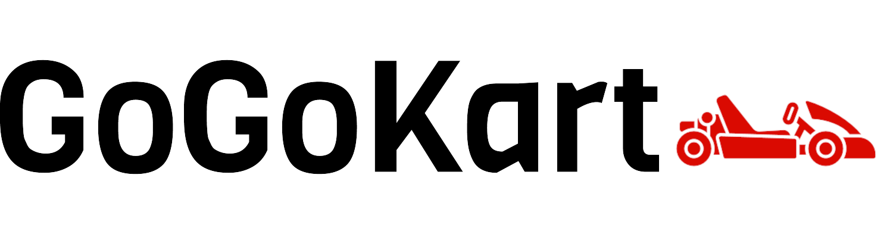

Miembros
 * :bust_in_silhouette:  Jaime Millán Gálvez     :octocat: [MizugorouZ](https://github.com/MizugorouZ)
 * :bust_in_silhouette:  Antonio Zambrano Fernández     :octocat: [jmillangalvez](https://github.com/jmillangalvez)

----- 

# Proceso de Diseño 

## Paso 1. UX Desk Research & Analisis 

 1.a Competitive Analysis
-----

A nuestro grupo de prácticas se le ha asignado las plataformas relacionadas con experiencia y planificación de ocio. Entre todas ellas, hemos decidido centrarnos en aquellas webs dedicadas a los tours. La web que hemos elegido ha sido FreeTour.com, una web donde puedes reservar tours gratis en cualquier lugar del mundo, que consiste en realizar un tour con un guía de forma totalmente gratuita y el precio lo pone el usuario mediante una propina en función del trabajo de dicho guía. Hemos elegido esta web porque nos gustó su apariencia a primera vista, está actualizada y el hecho de que ofrecen tours gratuitos llama mucho la atención a la hora de viajar.

No solo por estas razones hemos escogido FreeTour, pues hemos comparado con otras web del mismo estilo como son Civitatis, GranadaCity-Tour, GranadaTours y WalkinGranada. Hemos tenido en cuenta diversas características para realizar la decisión final de sobre cuál trabajar y finalmente llegamos a la conclusión de FreeTour y Civitatis eran las dos candidatas. Entre ellas elegimos FreeTour, ya que Civitatis no ofrecía tours virtuales, muy importantes actualmente, y además no disponía de muchos tours gratuitos.

El resto de opciones carecían de diversas características importantes como reviews, recomendaciones, etc o incluso no estaban actualizadas o estaban fuera de servicio.

 1.b Persona
-----
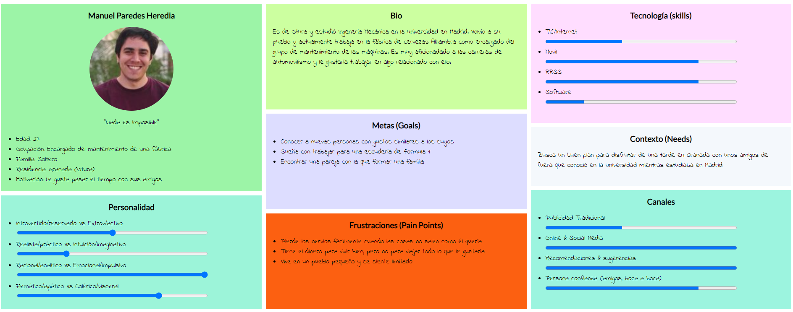

**Manuel:** Queríamos que Manuel fuese un ejemplo de persona formada, con estudios de posgrado, joven y cercano a los 30 años que no anda mal de dinero pero tampoco tiene para derrocharlo. Busca enseñarle la gastronomía de su ciudad a unos amigos de fuera, por lo que un tour guiado por los principales bares y tabernas puede ser una buena opción. Este perfil se sale del turista que busca monumentos pero que busca tours de otro estilo, por lo que podría ser un claro usuario de la web que estamos estudiando.

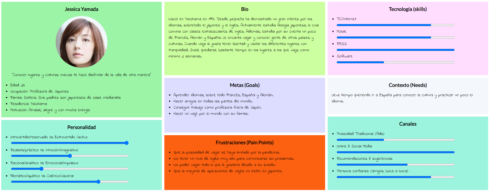

**Jessica:** Queríamos un perfil extranjero que viniera de vacaciones a España. Por ello decimos crear a Jessica, una chica japonesa amante de los idiomas y de las culturas europeas que viajaba siempre que podía. Debido a que viaja mucho, no puede gastar todo lo que gustaría en sus viajes. Por ello suele buscar alternativas baratas para los tour, alojamiento, etc, lo que la hace un perfil perfecto para nuestra web.

 1.c User Journey Map
----

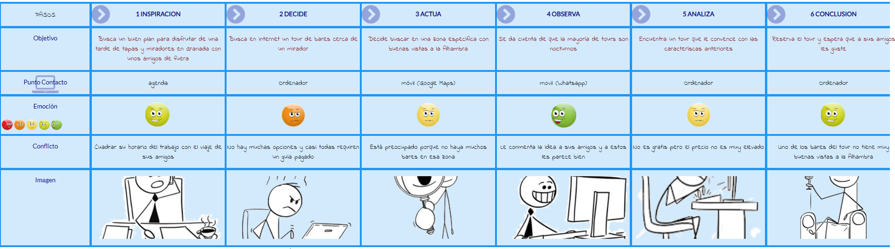

**Manuel:** Como hemos dicho, busca pasar una buena tarde con sus amigos por Granada y  para ello decide hacer un tour por los principales bares y tabernas, que además tengan buenas vistas a la Alhambra. Finalmente encuentra un tour nocturno, que ofrece una experiencia fantástica, aunque no es gratuito. A pesar de esto, tiene esperanza en que será un buen recuerdo bonito.

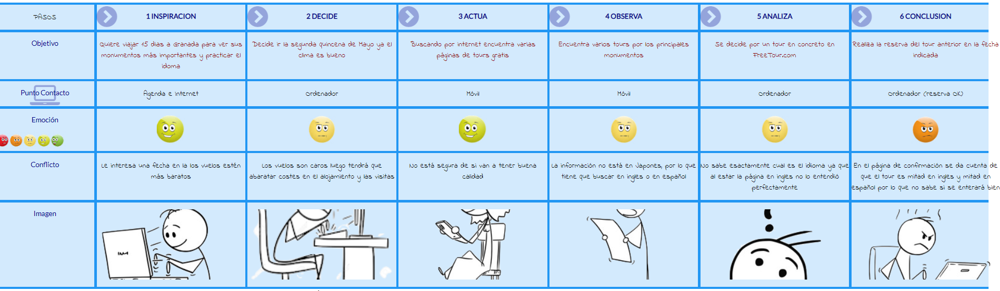

**Jessica:** Jessica quiere viajar 15 días a Granada. Busca una quincena con buen clima, lo que hace que el billete de avión sea más caro. Esto le hace buscar opciones más baratas para los tours, aunque no le convenza mucho la idea al principio. Encuentra un tour que le convence y cumple sus requisitos, pero una vez lo reserva se da cuenta de que la mitad del tour es en inglés, un idioma que maneja bien, y la otra en español, el cual no conoce muy bien. Termina un poco preocupada ya que no sabe si va a poder disfrutar del tour al 100%

 1.d Usability Review
----

>[Enlace al PDF del Usability Review](P1/UsabilityReview.pdf)

**Valoración Final:** 94

En general, la web es muy completa y funcional. La gran mayoría de características importantes para este tipo de webs las implementa de forma excelente, y solo falla en varios campos de poca importancia. Es por ello que la nota del Usability Review es muy alta, un 94, calificando la web de excelente. Desde el punto de vista de nuestros personajes cumple en una amplia mayoría las características que se evalúan, si bien tal vez para nuestro personaje extranjero podría tener menor nota ya que no se encuentra disponible su idioma. A pesar de esto, hemos intentando hacer una media entre los dos, además de que los tours también están en inglés, que es el principal idioma que se utiliza en el mundo.

En cuanto a la práctica, nos ha parecido muy interesante, ya que por primera vez nos ponemos en el punto de vista del usuario que puede ser muy distinto al del programador. Nos hace ver problemas donde creíamos que no los había, a la vez que darnos cuenta de características que hasta ahora pasábamos por alto, como por ejemplo la selección de fechas para un viaje con un calendario de forma intuitiva, en lugar de especificar a mano los días. También, nos ha parecido muy útil, ya que estos estudios de usabilidad, de competidores, de posibles usuarios… podemos realizarlos en cualquier aplicación que se nos ocurra, para tratar siempre de ofrecer la mejor experiencia al usuario final.

## Paso 2. UX Design  

 2.a POVs
----

**POV:** Persona 1

- **User:** Una persona adulta aficionada a los deportes de motor.

- **Need:** Desconectar del trabajo.

- **Insight:** Trabaja toda la semana y el finde le gustaría realizar alguna actividad
relacionada con el motor, como el karting, pero a ninguno de sus amigos le gusta por
eso busca gente para participar en alguna carrera.

**POV:** Persona 2

- **User:** Una madre cuyo hijo le gustan los coches.

- **Need:** Ofrecer a su hijo un hobby que le guste.

- **Insight:** A su hijo le gusta el mundo del motor pero no hay muchas actividades para
niños de su edad relacionadas con este y busca una forma fácil de organizar o
unirse a actividades ya creadas.

**POV:** Persona 3

- **User:** Un grupo de amigos.

- **Need:** Una forma de competir en los karts de una manera más formal.

- **Insight:** Van de vez en cuando a echar una carrera entre ellos pero les gustaría
pasar al siguiente nivel y competir con más gente con sus misma afición.

 2.b ScopeCanvas
----

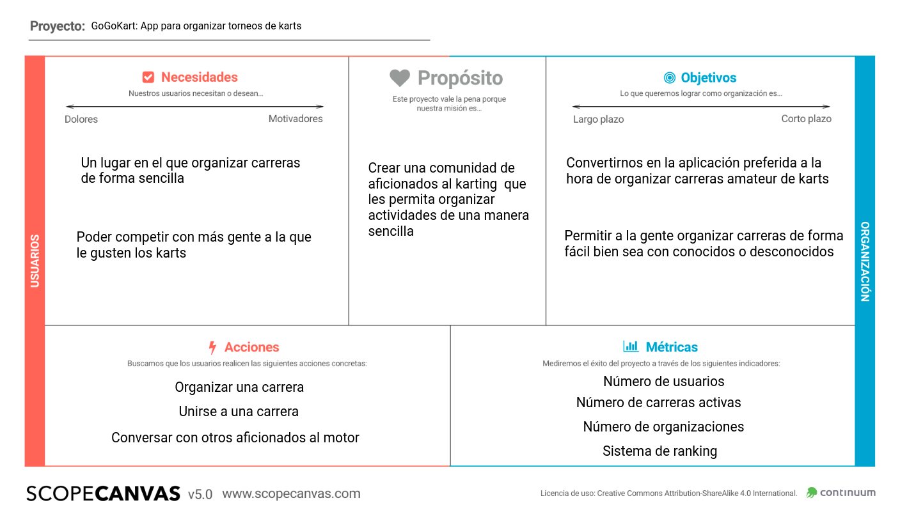

 2.b Tasks analysis: Task flow
-----

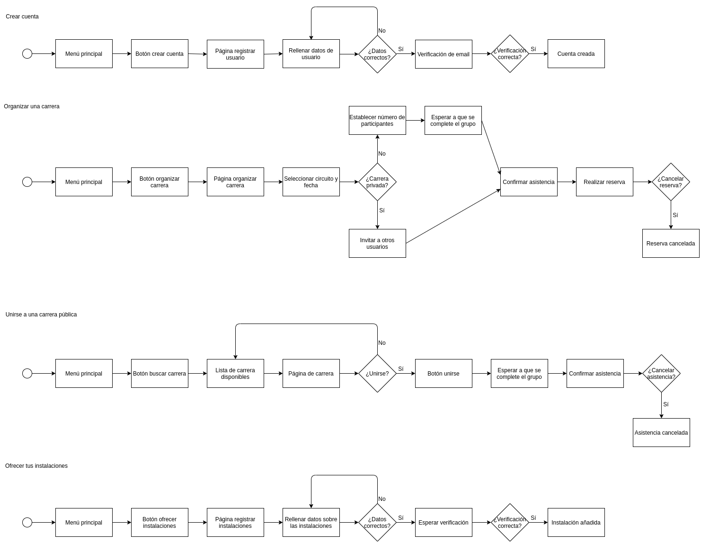

 2.c IA: Sitemap + Labelling 
----

**Site Map:**

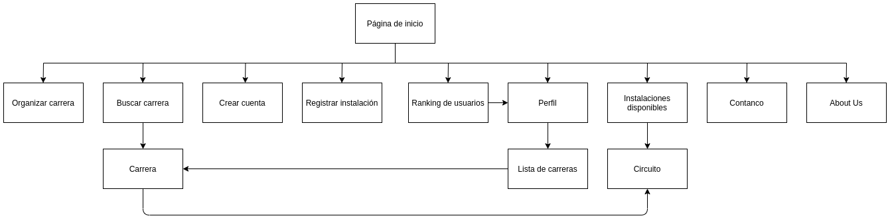

**Labelling:**

**Label** | **Scope note**     
| ------------- | -------
 Organizar carrera  | Lleva al menú que permite organizar una carrera. Icono: Bandera a cuadros con un símbolo “+”
 Buscar carrera  | Lleva a una lista de las carreras disponibles. Icono: Lupa con una bandera a cuadros dentro
 Crear cuenta  | Lleva al menú para crear una cuenta, diferenciando entre usuario e instalaciones. Icono: Monigote con un símbolo “+”
 Ranking de usuarios  | Lleva a la lista de usuarios. Tiene filtros y buscador para poder buscar a un usuario específico. Icono: Podio
 Perfil  | Lleva a la información de perfil. Icono: Imagen de perfil del usuario
 Registrar instalación  | Lleva a la página de registro de instalación. Solo puedes acceder con una cuenta de instalaciones. Icono: La silueta de un circuito con un símbolo “+”
 Instalaciones disponibles  | Lleva a la lista de circuitos disponibles. Icono: Silueta de un circuito
 Contacto  | Lleva a la página de contacto. Icono: teléfono
 About us  | Lleva a la página de información sobre la empresa. Icono: varios monigotes

 2.d Wireframes
-----

**Página inicio no registrado:** 

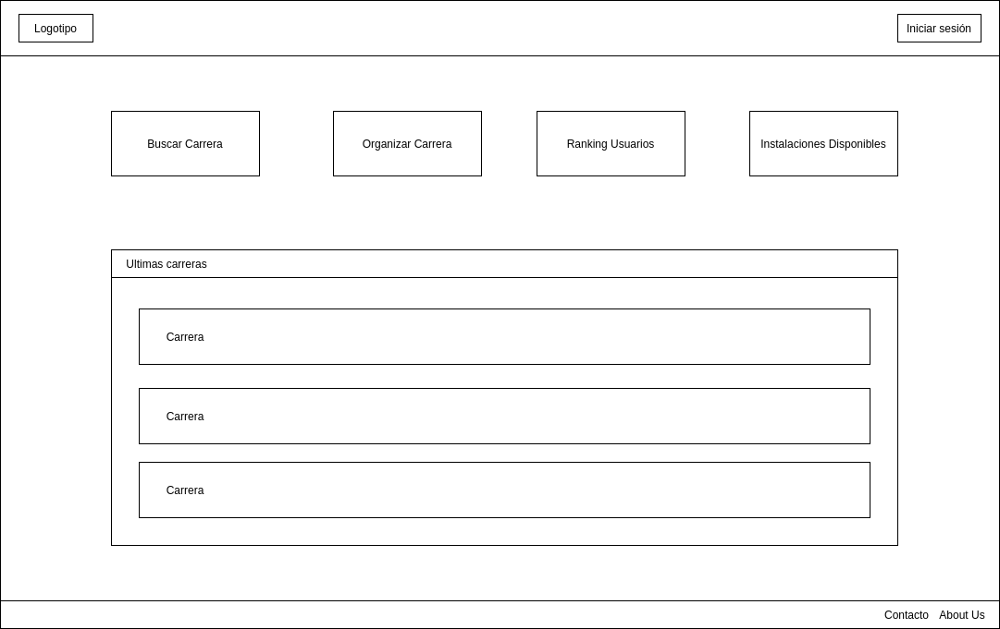

**Página inicio registrado:**

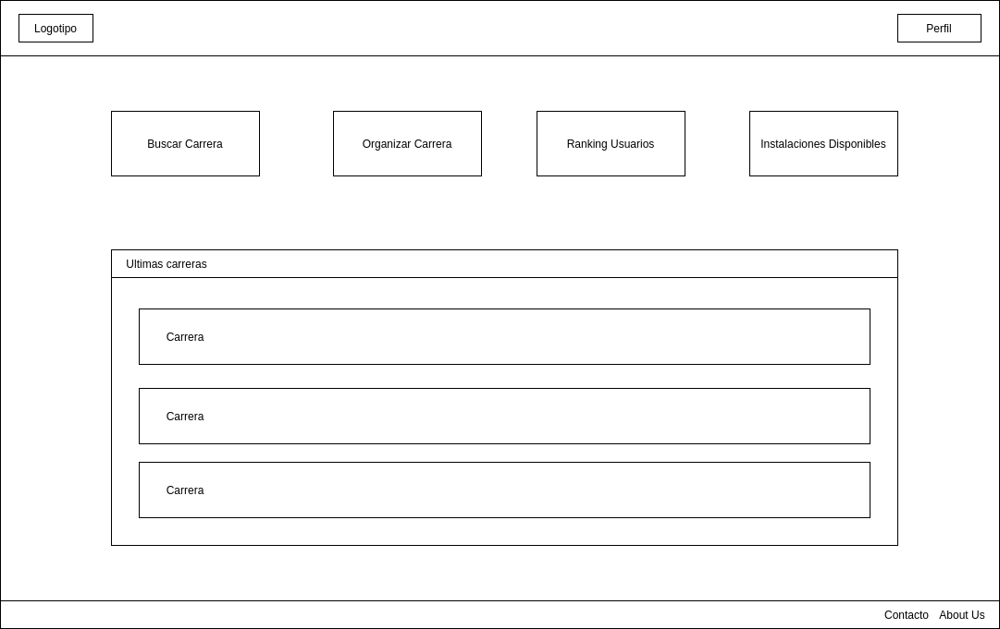

**Página inicio instalación:** 

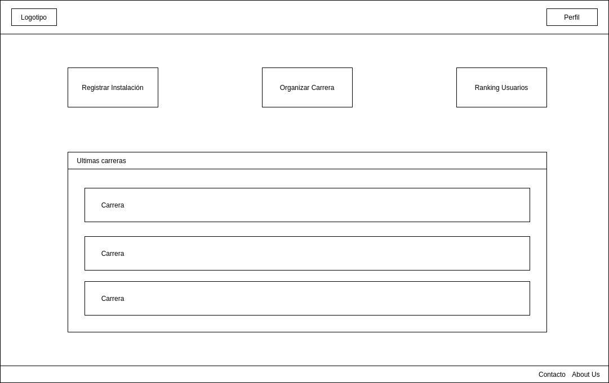

**Buscar carrera:** 

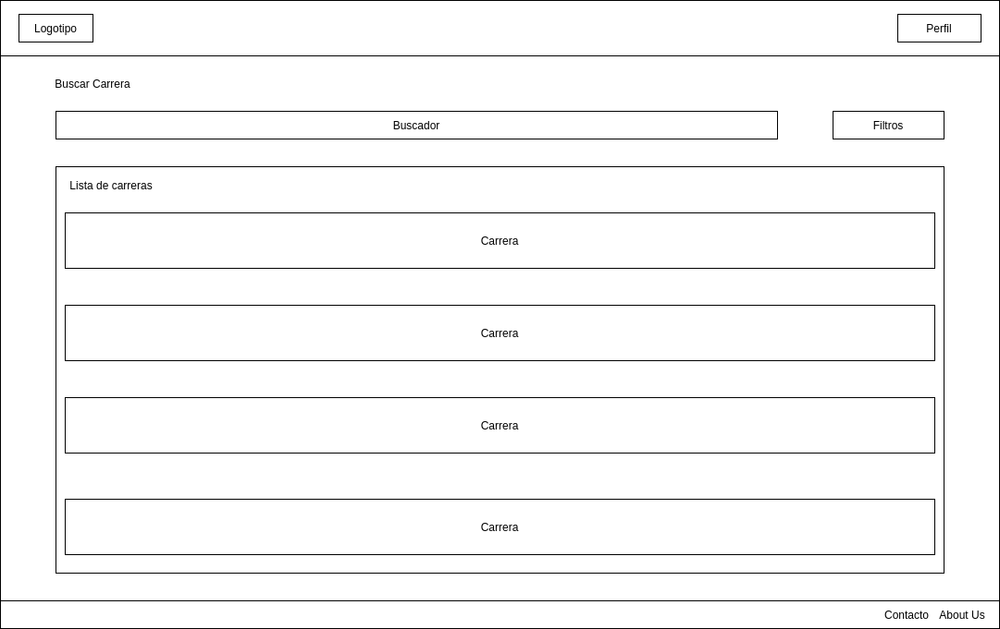

**Organizar carrera:** 

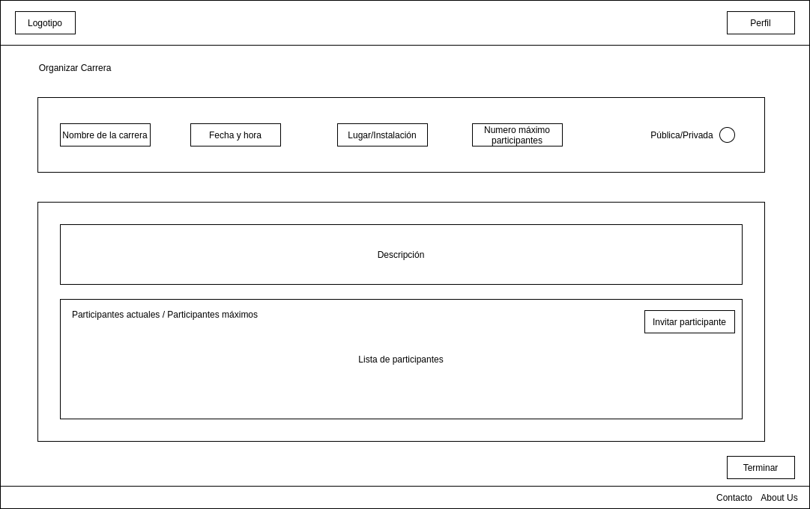

**Carrera:** 

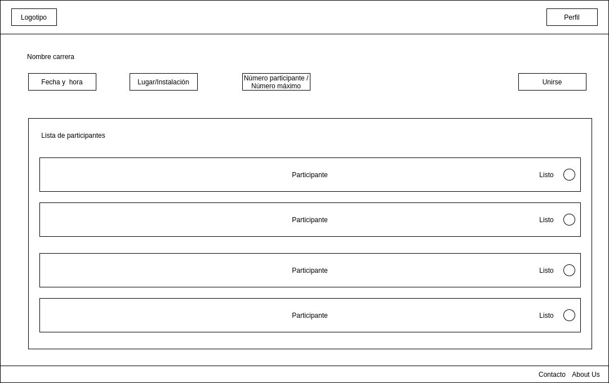

**Perfil:** 

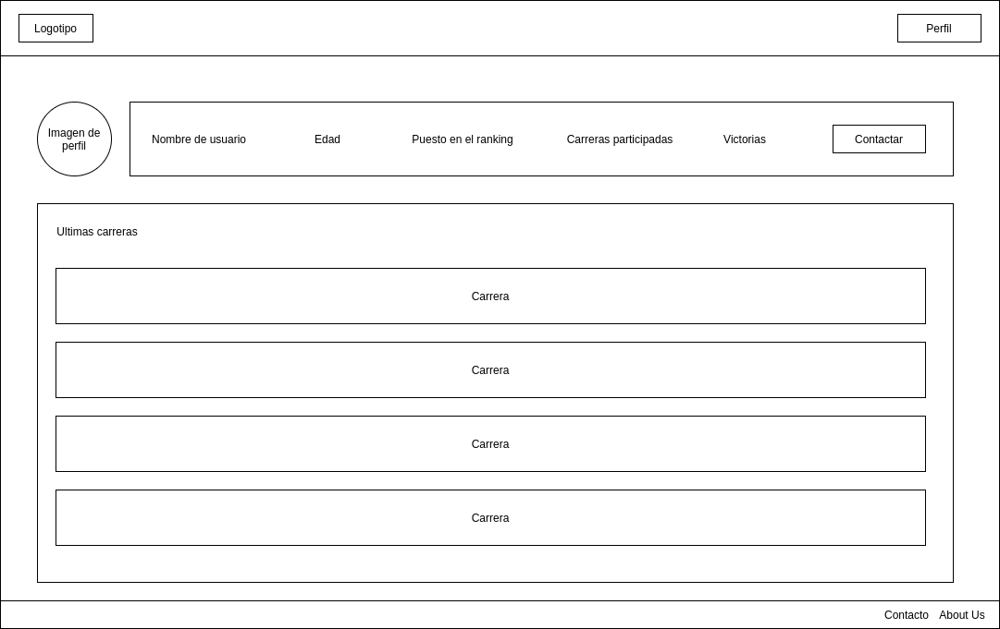

## Paso 3. Mi UX-Case Study (diseño)

 3.a Moodboard
-----

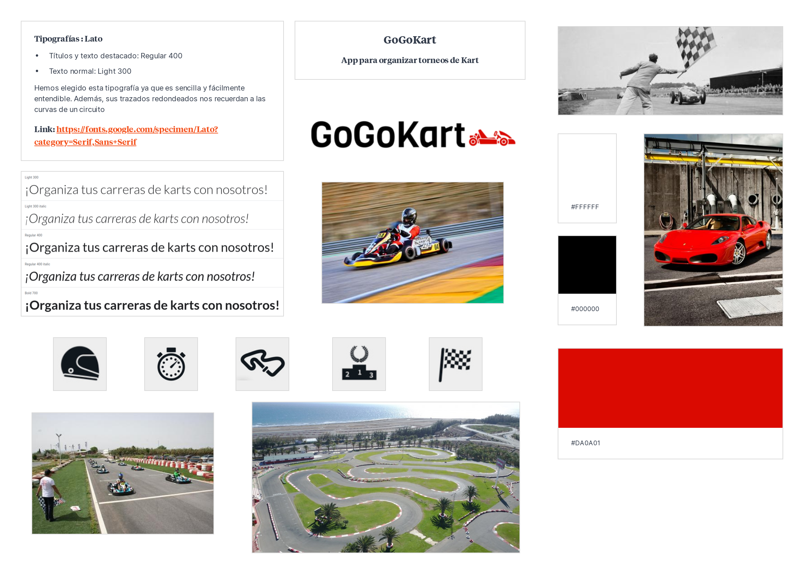

**Paleta de colores:** La elección de los colores blanco y negro viene sobre todo de la bandera a cuadros. Por otro lado el color rojo lo hemos escogido porque es un color que representa la pasión y la emoción, además de ser el color principal de Ferrari, muy conocido por su trayectoria en el mundo del motor.

**Tipografía:** Hemos elegido Lato debido a su sencillez y redondez, ya que sus curvas nos recuerdan a las de un circuito.

**Iconos:** Hemos elegido esos iconos por su sencillez y porque son fácilmente reconocibles.

**Logo:** La resolución del logo es de 1500x400px. Es un logo alargado, perfecto para cabeceras. Además, en la carpeta de logo hay otras opciones, como por ejemplo el mismo logo en blanco y otras versiones más cuadradas que pueden servir para fotos de perfil en las redes sociales.

  3.b Landing Page
----

 3.c Guidelines
----

>>> Estudio de Guidelines y Patrones IU a usar 
>>> Tras documentarse, muestre las deciones tomadas sobre Patrones IU a usar para la fase siguiente de prototipado. 

  3.d Mockup
----

>>> Layout: Mockup / prototipo HTML  (que permita simular tareas con estilo de IU seleccionado)

 3.e ¿My UX-Case Study?
-----

>>> Publicar my Case Study en Github..
>>> Documente y resuma el diseño de su producto en forma de video de 90 segundos aprox

## Paso 4. Evaluación 

 4.a Caso asignado
----

>>> Breve descripción del caso asignado con enlace a  su repositorio Github

 4.b User Testing
----

>>> Seleccione 4 personas ficticias. Exprese las ideas de posibles situaciones conflictivas de esa persona en las propuestas evaluadas. Asigne dos a Caso A y 2 al caso B
 

| Usuarios | Sexo/Edad     | Ocupación   |  Exp.TIC    | Personalidad | Plataforma | TestA/B
| ------------- | -------- | ----------- | ----------- | -----------  | ---------- | ----
| User1's name  | H / 18   | Estudiante  | Media       | Introvertido | Web.       | A 
| User2's name  | H / 18   | Estudiante  | Media       | Timido       | Web        | A 
| User3's name  | M / 35   | Abogado     | Baja        | Emocional    | móvil      | B 
| User4's name  | H / 18   | Estudiante  | Media       | Racional     | Web        | B 

. 4.c Cuestionario SUS
----

>>> Usaremos el **Cuestionario SUS** para valorar la satisfacción de cada usuario con el diseño (A/B) realizado. Para ello usamos la [hoja de cálculo](https://github.com/mgea/DIU19/blob/master/Cuestionario%20SUS%20DIU.xlsx) para calcular resultados sigiendo las pautas para usar la escala SUS e interpretar los resultados
http://usabilitygeek.com/how-to-use-the-system-usability-scale-sus-to-evaluate-the-usability-of-your-website/)
Para más información, consultar aquí sobre la [metodología SUS](https://cui.unige.ch/isi/icle-wiki/_media/ipm:test-suschapt.pdf)

>>> Adjuntar captura de imagen con los resultados + Valoración personal 

 4.d Usability Report
----

>> Añadir report de usabilidad para práctica B (la de los compañeros)

>>> Valoración personal 

## Paso 5. Evaluación de Accesibilidad  

  5.a Accesibility evaluation Report 
----

>>> Indica qué pretendes evaluar (de accesibilidad) sobre qué APP y qué resultados has obtenido 

>>> 5.a) Evaluación de la Accesibilidad (con simuladores o verificación de WACG) 
>>> 5.b) Uso de simuladores de accesibilidad 

>>> (uso de tabla de datos, indicar herramientas usadas) 

>>> 5.c Breve resumen del estudio de accesibilidad (de práctica 1) y puntos fuertes y de mejora de los criterios de accesibilidad de tu diseño propuesto en Práctica 4.

## Conclusión final / Valoración de las prácticas

>>> (90-150 palabras) Opinión del proceso de desarrollo de diseño siguiendo metodología UX y valoración (positiva /negativa) de los resultados obtenidos  

